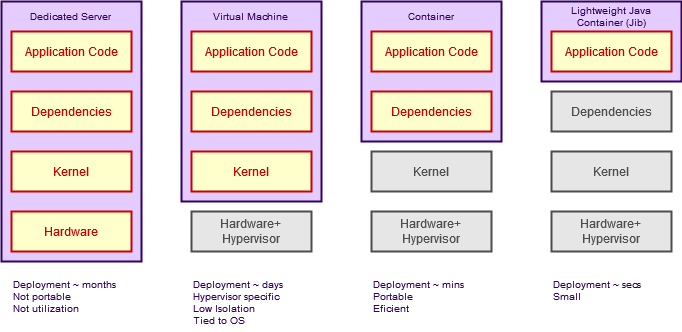
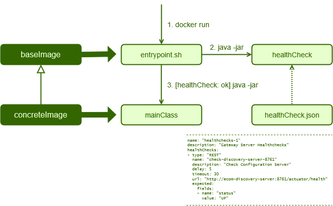
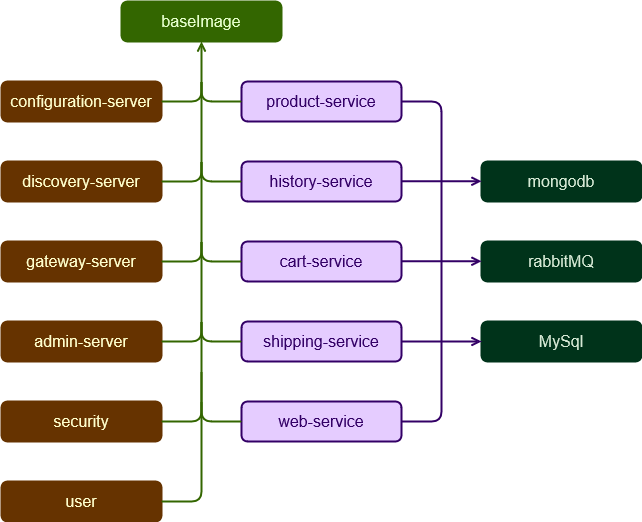
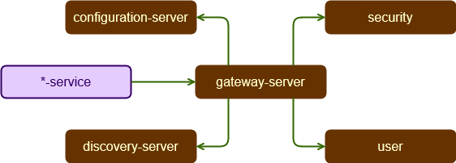
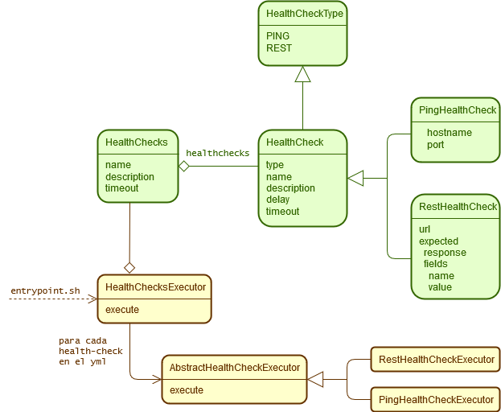

# Spring Cloud con Jib y Docker Compose

## Guía rápida

1. Incluir el plugin jib-maven-plugin en nuestro pom.xml

<details><summary>Declaración Jbi en pom.xml (Click para expandir)</summary>

```xml
<plugin>
	<groupId>com.google.cloud.tools</groupId>
	<artifactId>jib-maven-plugin</artifactId>
	<version>2.0.0</version>				
	<configuration>
		<from>
			<image>registry.gitlab.com/juancpaz/ecom/ecom-base-image:0.0.1-SNAPSHOT</image>
		</from>
		<to>
			<image>ecom/${project.artifactId}:${project.version}</image>
		</to>				
		<container>
			<entrypoint>
				<shell>bash</shell>
				<option>-c</option>
				<arg>chmod +x /entrypoint.sh &amp;&amp; sync &amp;&amp; /entrypoint.sh --mainclass com.juancpaz.ecom.registry.DiscoveryServer --healthcheck</arg>
			</entrypoint>					
			<ports>
				<port>9000</port>
			</ports>
			<creationTime>USE_CURRENT_TIMESTAMP</creationTime>						
		</container>
	</configuration>
	<executions>
		<execution>
			<phase>install</phase>
			<goals>
				<goal>dockerBuild</goal>
			</goals>
		</execution>
	</executions>
</plugin>

```

</details>


A destacar, se usa ecom-base-image come imagen base, se indica explicitamente la MainClass del servicio con el parámetro --healthcheck, que es un parámetro para entrypoint.sh, no para el servicio.

2. En el src/main/resources se crea un fichero health-check.yml con los health checks deseados, por ejemplo:

<details><summary>Declaración de health-check.yml (Click para expandir)</summary>

```yml
name: "healthchecks-1"
description: "Discovery Server Healthchecks"
healthChecks:
- type: "PING"
  name: "rabbit-healthcheck-15672"
  description: "RabbitDBHealthCheck 1"
  delay: 5
  timeout: 30
  hostname: "ecom-rabbit1"
  port: 15672
- type: "PING"
  name: "rabbit-healthcheck-5672"
  description: "RabbitDBHealthCheck 1"
  delay: 5
  timeout: 30
  hostname: "ecom-rabbit1"
  port: 5672  
- type: "PING"
  name: "mongodb-healthcheck-27017"
  description: "MongoDBHealthCheck 1"
  delay: 5
  timeout: 30
  hostname: "ecom-mongodb"
  port: 27017
- type: "REST"
  name: "check-configuration-server-8888"
  description: "Check Configuration Server"
  delay: 5
  timeout: 30
  url: "http://ecom-configuration-server:8888/actuator/health"
  expected:
    response: "{\"status\":\"UP\"}"
```

</details>


3. Y esto sería todo, podremos levantar nuestros servicios con un docker-compose como:

<details><summary>docker-compose.yml (Click para expandir)</summary>

```yml
version: '3.7'
services:
  ecom-rabbit1:
    container_name: ecom-rabbit1
    image: 'rabbitmq:3-management'
    hostname: rabbit1
    expose:
      - 15672
      - 5672
    ports:
      - '15672:15672'
      - '5672:5672'
    volumes:
      - 'rabbitmq_data:/data'
    networks:
      - ecom-network
  ecom-mongodb:
    container_name: ecom-mongodb
    image: 'mongo:latest'
    environment:
      MONGO_INITDB_ROOT_USERNAME: root
      MONGO_INITDB_ROOT_PASSWORD: rootpassword
    expose:
      - 27017
    ports:
      - '27017:27017'
    depends_on:
      - ecom-rabbit1
    volumes:
      - 'mongodb_data_container:/data/db'
    networks:
      - ecom-network      
  ecom-configuration-server:
    container_name: ecom-configuration-server
    image: 'ecom/ecom-configuration-server:0.0.1-SNAPSHOT'
    environment:
      - SPRING_PROFILES_ACTIVE=container
    expose:
      - 8888
    ports:
      - '8888:8888'
    depends_on:
      - ecom-rabbit1
      - ecom-mongodb
    networks:
      - ecom-network
  ecom-discovery-server:
    container_name: ecom-discovery-server
    image: 'ecom/ecom-discovery-server:0.0.1-SNAPSHOT'
    environment:
      - SPRING_PROFILES_ACTIVE=container
      - SPRING_CLOUD_CONFIG_URI=http://ecom-configuration-server:8888
      - EUREKA_INSTANCE_PREFER_IP_ADDRESS=true      
    expose:
      - 8761
    ports:
      - '8761:8761'
    depends_on:
      - ecom-rabbit1
      - ecom-mongodb
      - ecom-configuration-server
    links:
      - 'ecom-configuration-server:ecom-configuration-server'
      - 'ecom-rabbit1:ecom-rabbit1'
      - 'ecom-mongodb:ecom-mongodb'
    networks:
      - ecom-network
volumes:
  mongodb_data_container: null
  rabbitmq_data: null
networks:
  ecom-network:
    driver: bridge      
```

</details>


## Introducción

Cuando desplegamos arquitecturas de microservicios frecuentemente nos encontramos con dependencias entre contenedores, que obliga a arrancarlos en un orden específico.

Nos debemos asegurar de que cada contenedor ha arrancado correctamente y que los servicios que implementa están disponibles antes de arrancar los dependientes. Con Kubernetes u OpenShift este control lo proporcionan distintos mecanismos de los orquestadores, pero mientras desarrollamos en nuestro local, nos puede interesar una infraestructura más liviana orquestada con Docker Compose.

En este articulo expongo una aproximación todavía parcial en el contexto de una aplicación completa de comercio electrónico con una arquitectura CQRS-ES usando Axon Framework

Por una parte iremos un paso más allá del uso común de Jib, implementado una imagen base que proporcione funcionalidades adicionales a las imágenes propias del proyecto

Por otra, implementaremos un sistema de HealthCheck de contenedores parametrizable, que permita a cada contenedor realizar las comprobaciones que le interesen.

La arquitectura del Sistema de Comercio Electrónico usado se basa, de hecho ES, la expuesta en el libro [Practical Microservices Architectural Patterns: Event-Based Java Microservices with Spring Boot and Spring Cloud](https://www.amazon.es/Practical-Microservices-Architectural-Patterns-Event-Based/dp/1484245008), pero dockerizada y con las adaptaciones que se verán.

Los fuentes de este articulo están subidos a github:

* [ecom-system](https://github.com/juancpaz/ecom)
* [ecom-config-repo](https://github.com/juancpaz/ecom-config-repo)
* [docker-compose]()

No es el objeto de este articulo exponer la arquitectura CQRS-ES, ni otros detalles que aquí se mencionen muy de pasada, y es un trabajo en progreso, con muchos flecos todavía sin resolver que, con el tiempo, espero tener la oportunidad de ir comentando en futuros artículos.

## La idea general

Jib es un plugin de maven/gradle que automáticamente gestiona las capas de las imágenes Docker generadas por el build, discrimina elementos de S.O, dependencias java y el programa propiamente dicho, para reutilizarlas entre contenedores, y para que durante el build/push/pull no sea necesario trasmitir imágenes completas. 

Era una evolución lógica en tecnología de contenedores para JVM, considerando que la mayor parte de un programa Java son dependencias, no tiene sentido subir imágenes de varios GB's sólo por haber cambiado un literal.



Otra característica de Jib es que no usa Dockerfile's, todo lo necesario para definir la imagen se debe declarar en el pom.xml de maven, p.e. 

<details><summary>Declaración Jbi en pom.xml (Click para expandir)</summary>

```xml
<plugin>
	<groupId>com.google.cloud.tools</groupId>
	<artifactId>jib-maven-plugin</artifactId>
	<version>2.1.0</version>
	<configuration>
		<from>
			<image>registry.gitlab.com/juancpaz/ecom/ecom-base-image:0.0.1-SNAPSHOT</image>
		</from>
		<to>
			<image>ecom/${project.artifactId}:${project.version}</image>
		</to>
		<container>
			<entrypoint>
				<shell>bash</shell>
				<option>-c</option>
				<arg>chmod +x /entrypoint.sh &amp;&amp; sync &amp;&amp; /entrypoint.sh --mainclass com.juancpaz.ecom.registry.DiscoveryServer --healthcheck</arg>
			</entrypoint>					
			<ports>
				<port>8761</port>
			</ports>
			<creationTime>USE_CURRENT_TIMESTAMP</creationTime>
		</container>
	</configuration>
	<executions>
		<execution>
			<phase>install</phase>
			<goals>
				<goal>dockerBuild</goal>
			</goals>
		</execution>
	</executions>				
</plugin>
```

</p></details>

Con Jib declaramos la imagen base, la imagen que queremos generar y el entrypoint del container entre otros elementos, para los detalles se puede consultar la documentación de [Jib](https://github.com/GoogleContainerTools/jib)

Por defecto, Jib genera una imagen con un entrypoint

```java
java ${JAVA_OPTS} -noverify -XX:+AlwaysPreTouch -cp /app/resources/:/app/classes/:/app/libs/*
```

La idea me la dio el hecho de que por una parte se pueda incluir código ejecutable arbitrario como entrypoint, y por otra, que una imagen herede todo lo incluido en su imagen base.

Podemos personalizar nuestra imagen base tanto como sea necesario incluyendo, por ejemplo, paquetes linux adicionales...

```bash
# En el entrypoint.sh
function install_packages() {
	echo -n "Installing pakages... "
	apt-get update > /dev/null 2>&1
	for package in $(cat /packages.txt); do
		apt-get install -y ${package} > /dev/null 2>&1
	done
	echo "Done"
}

install_packages
```

o realizar operaciones más complejas como comprobar el estado de servicios externos.

La imagen base se comportara, permitidme la licencia, como una imagen abstracta, y las imágenes que la heredan como imágenes concretas. La operación de HealthCheck se declara en la base, pero la declaración de HealthCheks y la ejecución propiamente dicha de la comprobación se realiza en la imagen concreta.



El sistema que he implementado, declara comprobaciones en ficheros yaml, aunque también entiende json y xml, por ejemplo:

```yaml
name: "healthchecks-1"
description: "Gateway Server Healthchecks"
healthChecks:
- type: "REST"
  name: "check-discovery-server-8761"
  description: "Check Configuration Server"
  delay: 5
  timeout: 30
  url: "http://ecom-discovery-server:8761/actuator/health"
  expected: 
    fields:
    - name: "status"
      value: "UP"
```

Declara un healthcheck contra el actuator del discovery de Eureka con un timeout de 30 segundos, si transcurrido el timeout el discovery no ha respondido con status UP, la ejecución del Gateway finaliza:

```bash
if [ "${ac_skip_healthcheck}" = "true" ]; then
	echo "Health Check skipped"
else
	if [ "${ac_command}" = "healthcheck" ]; then		
		echo "Executing Healthchecks"
		exec_healthchecks
	fi
fi
if [ "${ac_skip_service}" = "false" ]; then
	if [ ! "${ac_healthcheck_result}" = "ERROR" ]; then
		entry_point
	fi
else 
	echo "Skipping Service Execution"
fi
```

Antes de entrar en detalles de como se implementó, y cómo se usa, el mecanismo de heatlhcheck, voy a repasar brevemente la arquitectura del sistema al que da soporte. 

Se trata de una aplicación compleja de comercio electrónico, la típica tienda online, con su gestión de inventario, carrito, usuarios, compras, etc. Uso esta aplicación porque mi intención es estudiar el patrón CQRS-ES, y el [Framework AXON](https://axoniq.io/)

## Contenedores

El sistema se estructura en varios componentes, más o menos independientes:

* Infraestructura:
  - configuration-server
  - discovery-server
  - gateway-server
  - admin-server
  - security-service
  - user-service
* Servicios:
  - product-service
  - history-service
  - cart-service
  - shipping-service
* Aplicación:
  - web-server
* Externos:
  - MongoDB
  - RabbitMQ
  - MySql

La siguiente imagen ilustra los contenedores y sus dependencias:



El nombre de cada componente es suficientemente descriptivo, de momento sólo están implementados los de configuration, discovery, gateway y admin, y parcialmente, product y web. Por diseño, la aplicación puede seguir trabajando con funcionalidad reducida si algún servicio no está disponible.

La seguridad, autenticación y autorización, todavía sin habilitar, usará OAuth.

El servidor de configuración es el único que no depende de otros, es el servidor de Configuración centralizada y gestiona ficheros yaml en git: [ecom-config-repo](https://github.com/juancpaz/ecom-config-repo)

El servidor de discovery es un servidor Eureka para el registro y descubrimiento de servicios, mientras que en el Gateway se comporta como API Manager centralizado con seguridad delegada en el security server.

El gateway realiza su trabajo usando distintos frameworks de Netflix y Apache integrados en Spring Cloud:

* Zuul: Proxy inverso que usa Ribbon para localizar instancias concretas de microservicios
* Ribbon: Balanceador y enrutado dinámico
* Hystrix: Resistencia a fallos
* Feign: Clientes Eureka

Una vez desplegados, todas las peticiones se encauzan a través del gateway, que las resuelve contra el discovery, aplicando seguridad, balanceo, filtros, etc...



Internamente, cada contenedor de servicio resuelve un contexto de dominio, separando Consultas y Comandos, con consistencia eventual, y aplicando SAGA's cuando es necesario resolver las transacciones más complejas.

## Sistema de HealthCheck

Llegamos al objetivo principal de este artículo, comentar el sistema de HealthCheck, implementado en la imagen base que heredan el resto de imágenes que necesitan que se den ciertas condiciones antes de arrancan. 

Por ejemplo, todos necesitan que el servidor de configuración esté arrancado, o el gateway necesita el discovery, los servicios de negocio necesitan lo servidores de persistencia, el de mensajería, además de todos los de infraestructura.

Podemos reducir el número de comprobaciones y el tiempo que tardan en ejecutarse si arrancamos todos los contenedores en el orden adecuado, aunque la configuración no necesita BD, arrancamos estos servidores, a su vez sin dependencias.

El orden en el que se arrancan los contenedores puede ser de menos dependientes a más dependientes, observando dependencias entre ellos para que no surjan dependencias circulares.

La imagen base contiene tanto el entrypoint.sh, que es lo que se ejecuta al arrancar el contenedor, como el programa java propiamente dicho. Estos 2 elementos se heredan en las imágenes derivadas y estarán disponibles en los contenedores derivados, y ya cada uno declarará en yaml las comprobaciones que le interesen.

### El entrypoint en baseimage

El [entrypoint.sh](https://github.com/juancpaz/ecom/blob/master/ecom-base-image/src/main/jib/entrypoint.sh) es un shell script de bash que se ejecuta al arrancar el contenedor derivado

En resumen, 

1. Ejecuta los healthchecks, buscando por este orden, ficheros health-check.yml, health-check.json o health-check.xml
1. Si los healthcheck detectan un problema, entrypoint finaliza, finalizando también el contenedor, si finalizan sin error, ejecuta el servicio cuya clase main se le pasa por parametro

La ejecución del entrypoint se parametriza desde el plugin de Jib del pom.xml del servicio derivado, p.e.

```xml
	<entrypoint>
		<shell>bash</shell>
		<option>-c</option>
		<arg>chmod +x /entrypoint.sh &amp;&amp; sync &amp;&amp; /entrypoint.sh --mainclass com.juancpaz.ecom.admin.AdminServer --healthcheck</arg>
	</entrypoint>	
```

Si queremos saltar el healthcheck o indicar otro fichero de declaración, debemos indicarlo en los parametros de entrypoint.sh

```bash
$ ./entrypoint.sh 
Sintaxis: ./entrypoint.sh options [filename]
Opciones:
  --help           Mostrar esta ayuda
  --build-base     Para debug
  --nop            Para debug
  --test           Para debug
  --mainclass MainClass
                   Declara MainClass como Main del servicio
  --healthcheck [filename]
                   Ejecuta los healthchecks declarados en filename (path absoluto)
                   Ignora healthcheck.yml en classpath si existe
  --skip-healthcheck
                   Ejecutar servicio, no ejecutar healthcheck
  --skip-service   Ejecutar sólo healthcheck
```

### Declaración de health checks

El script de entrypoint.sh busca el healthcheck.yaml en el classpath, es decir, debemos declarar el fichero en el src/main/resource para que se copie al classpath, por su parte, jib copia todo lo pongamos src/main/jib a la raiz de la imagen.

De momento, se pueden declarar 2 tipos de HealthCheck, PING que sólo comprueba que el host:puerto indicado este disponible, y REST, que realiza un GET sobre una url y valida la respuesta recibida contra un valor esperado.

healthchecks.yml
name              nombre global
description       descripción global, no se usa
timeout           tiemeout global, no se usa
checkouts         lista de checkouts
  type            PING | REST
  name            nombre del checkout 
  description     descripción del checkout
  delay           retardo, no se usa
  timeout         timeout del check, si se sobrepasa, el check se da por fallado
  hostname        PING
  port            PING
  url             REST
  expected        Respuesta esperada para REST
    response      expresión REST completa, por ejemplo "{\"status\":"\UP\"}"
    fields        Para respuestas más complejas comprobar campos concretos (sólo para primer nivel de anidacion)
      name        nombre del campo, p.e: status
      value       valor del campo, p.e: UP

Algunos ejemplos: 

<details><summary>health-check.yml del discovery (Click para expandir)</summary>

```yaml
name: "healthchecks-1"
description: "Configuration Server Healthchecks"
healthChecks:
- type: "PING"
  name: "rabbit-healthcheck-15672"
  description: "RabbitDBHealthCheck 1"
  delay: 5
  timeout: 30
  hostname: "ecom-rabbit1"
  port: 15672
- type: "PING"
  name: "rabbit-healthcheck-5672"
  description: "RabbitDBHealthCheck 1"
  delay: 5
  timeout: 30
  hostname: "ecom-rabbit1"
  port: 5672  
- type: "PING"
  name: "mongodb-healthcheck-27017"
  description: "MongoDBHealthCheck 1"
  delay: 5
  timeout: 30
  hostname: "ecom-mongodb"
  port: 27017
- type: "REST"
  name: "check-configuration-server-8888"
  description: "Check Configuration Server"
  delay: 5
  timeout: 30
  url: "http://ecom-configuration-server:8888/actuator/health"
  expected:
    response: "{\"status\":\"UP\"}"
```

</details>

<details><summary>health-check.yml del gateway (Click para expandir)</summary>

```yaml
name: "healthchecks-1"
description: "Gateway Server Healthchecks"
healthChecks:
- type: "REST"
  name: "check-discovery-server-8761"
  description: "Check Configuration Server"
  delay: 5
  timeout: 30
  url: "http://ecom-discovery-server:8761/actuator/health"
  expected: 
    fields:
    - name: "status"
      value: "UP"
```

</details>

### Ejecución de HealthChecks

El programa de HealthCheck es una apllicacion Spring Boot que implementa CommandLineRunner, en el mismo proyecto maven que genera la imagen base, [ecom-base-image](https://github.com/juancpaz/ecom/tree/master/ecom-base-image), y que también incluye el entrypoint.sh, asi como el fichero de paquetes debian que se instalarán automaticamente: [packages.txt](https://github.com/juancpaz/ecom/blob/master/ecom-base-image/src/main/jib/packages.txt)

Jib no genera un jar autocontenido, genera 3 directories (/app/resources, /app/classes y /app/libs), para luego poder crear las imagenes en capas, por ello ejecutar la aplicación desde la linea de comandos con `java -jar`, aunque podríamos usar 2 perfiles distintos, uno para generar el jar de spring boot convencional, otro para Jib

También podriamos ejecutar el contenedor de base-image indicandole el parámetro --skip-service

En cualquier caso, el punto de entrada es CommandLineTool.run(), CommandFactory crea el Command, y un CommandExecutor, lo ejecuta, el único comando implementado es health-check, HealthCheckCommand.

HealthCheckCommand parsea el fichero health-check.yml y crea un HealthChecks con una coleccion de HealthCheck, que serán PingHealthCheck o RestHealthCheck.

Por ultimo, el HealthCheckCommand lanza HealthChecksExecutor.execute(healthChecks)

La siguiente figura resume lo comentado:



### Creación de nuevos HealthChecks

Tomando como referencia los ya implementados, bastaría com implementar la definición HealthCheck, y su ejecutor, AbstractHealthCheckExecutor. 

Por ejemplo, si queremos implementar uno que verifique la existencia de un fichero:

```java
public enum HealthCheckType {
	PING("ping"), REST("rest"), FEXISTS("fexists");
	...
}

@Data
@EqualsAndHashCode(callSuper=true)
public class FileExistsHEalthCheck extends HealthCheck {
	private String filename;
}

@Component
public class PingHealthCheckExecutor extends AbstractHealthCheckExecutor {
	@Override
	protected Boolean executeHeathCheck(HealthCheck healthCheck) throws Exception {
		final Path path = Paths.get(healthCheck.getFilename());
		return Files.exists(path);
	}
}

```

Y algo que habría que mejorar porque sin duda se puede evitar, añadir el executor a HealthChecksExecutor

```java
@Slf4j
@Service
public class HealthChecksExecutor {
	@Autowired 
	private PingHealthCheckExecutor pingHealthCheckExecutor;
	@Autowired 
	private RestHealthCheckExecutor restHealthCheckExecutor;
	@Autowired
	private FileExistsCheckExecutor fileExistsHealthCheckExecutor; // Nuevo HealthCheck

	public Boolean execute(HealthChecks healthChecks) throws HealthCheckException {
		...
		for (HealthCheck healthCheck: healthChecks.getHealthChecks()) {
			...
			} else if (healthCheck.getType() == HealthCheckType.REST) {
				callableExecutor.setHealthCheckExecutor(restHealthCheckExecutor);
			} else if (healthCheck.getType() == HealthCheckType.FEXISTS) { // Nuevo HealthCheck
				callableExecutor.setHealthCheckExecutor(FileExistsHealthCheckExecutor);
			}
			...
		}
		...
	}
}	

```

## Referencias

https://enmilocalfunciona.io/construccion-de-imagenes-docker-con-jib/
https://github.com/GoogleContainerTools/jib

## Temas pendientes y próximos pasos

* Estudiar si esto es útil con otros orquestadores, como Kubernetes u OpenShift
* Generalizar y crear un starter como los de spring boot, para reutilizar esta arquitectura en otros proyectos
* Mejorar el mecanismo para implementar otros tipos de HealthCheck
* Implementar timeout global para el conjunto de healthchecks
